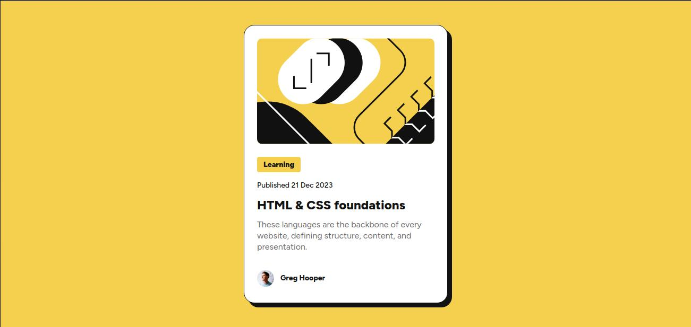

# Frontend Mentor - Blog preview card solution

This is a solution to the [Blog preview card challenge on Frontend Mentor](https://www.frontendmentor.io/challenges/blog-preview-card-ckPaj01IcS). Frontend Mentor challenges help you improve your coding skills by building realistic projects. 

## Table of contents

- [Overview](#overview)
  - [The challenge](#the-challenge)
  - [Screenshot](#screenshot)
  - [Links](#links)
- [My process](#my-process)
  - [Built with](#built-with)
  - [What I learned](#what-i-learned)
  - [Continued development](#continued-development)
  - [Useful resources](#useful-resources)
- [Author](#author)

## Overview

### The challenge

Users should be able to:

- See hover and focus states for all interactive elements on the page

### Screenshot



### Links

- Solution URL: [Add solution URL here](https://your-solution-url.com)
- Live Site URL: [Add live site URL here](https://blog-preview-card-edson.netlify.app/)

## My process

### Built with

- Semantic HTML5 markup
- CSS custom properties
- Flexbox
- Mobile-first workflow

### What I learned

Using CSS clamp().

```html
<main class="main">
    <div class="blog-card">
      <div class="blog-image"></div>
      <div class="blog-content">
        <h2 class="blog-tag">Learning</h2>
        <p class="blog-date">Published 21 Dec 2023</p>
        <h1 class="blog-title">HTML & CSS foundations</h1>
        <p class="blog-description">
          These languages are the backbone of every website, defining structure, content, and presentation.
        </p>
      </div>
      <div class="blog-author">
        
        <h2 class="blog-author-name">Greg Hooper</h2>
      </div>
    </div>
  </main>
```
```css
font-size: clamp(12px, 2vw, 14px);
font-size: clamp(14px, 2vw, 16px);
font-size: clamp(20px, 3vw, 24px);
```

### Continued development

Need better understanding about ways of making dynamic content without media queries.

### Useful resources

- [MDN: clamp()](https://developer.mozilla.org/en-US/docs/Web/CSS/clamp)
- [Paige Niedringhaus: CSS Clamp(): The Responsive Combination We’ve All Been Waiting For](https://blog.bitsrc.io/css-clamp-the-responsive-combination-weve-all-been-waiting-for-f1ce1981ea6e)

## Author

- Frontend Mentor - [@rodriguesedson](https://www.frontendmentor.io/profile/rodriguesedson)
